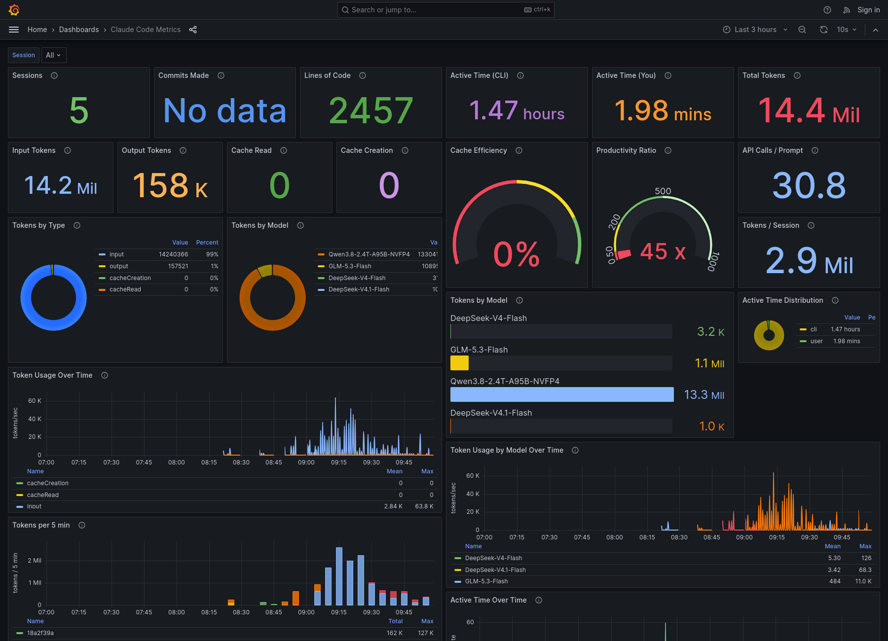

# Claude Code Grafana Observability Stack

A complete observability stack for monitoring Claude Code token usage, sessions, model latency and tool activity using OpenTelemetry, Prometheus, Loki, and Grafana. Several Claude Code instances can send to the same stack; every panel can be filtered per session.



## Quick Start

### 1. Start the Stack

```bash
make up
```

This starts:
- **OpenTelemetry Collector** (ports 4317/4318) - receives telemetry from Claude Code
- **Prometheus** (port 9090) - stores metrics
- **Loki** (port 3100) - stores logs/events
- **Grafana** (port 3000) - visualizes everything

### 2. Configure Claude Code

**Option A: Use the setup script (each terminal session)**

```bash
source setup-env.sh
claude
```

**Option B: Create a convenience alias (recommended)**

Add this to your `~/.zshrc` or `~/.bashrc`:

```bash
alias claude-telemetry='source /path/to/claude-grafana/setup-env.sh && claude'
```

Then use:
- `claude` - Normal Claude Code (no telemetry)
- `claude-telemetry` - Claude Code with telemetry enabled

This gives you control over when telemetry is collected without the overhead of permanent environment variables.

**Option C: Set environment variables manually**

```bash
export CLAUDE_CODE_ENABLE_TELEMETRY=1
export OTEL_METRICS_EXPORTER=otlp
export OTEL_LOGS_EXPORTER=otlp
export OTEL_EXPORTER_OTLP_PROTOCOL=grpc
export OTEL_EXPORTER_OTLP_ENDPOINT=http://localhost:4317
claude
```

### 3. View Dashboards

Open [http://localhost:3000](http://localhost:3000) (login: admin/admin)

### 4. Shutting Down

When you're done, exit Claude normally. The Docker containers will continue running in the background. To stop them:

```bash
make down
```

This command can be run from any terminal as long as you're in the project root directory. Use `make clean` instead if you want to remove all collected data.

## Dashboard Features

The pre-configured dashboard (**Claude Code Metrics**) has a **Session** selector at the top: pick one or more sessions, or **All** for the global view. Every panel follows the selection, and every total covers the time range picked in Grafana (top right).

### Overview
- Sessions, total tokens, lines of code, commits
- Active time (CLI and user) and productivity ratio
- Input / output / cache tokens and cache efficiency
- Tokens per session and API calls per prompt (agent loop depth, subagents included)

### Token Usage
- Tokens by type and by model (pie charts)
- Tokens by model over the selected range (bars; `[1m]` context variants are merged)
- Token usage over time, by type and by model
- Tokens per 5 min, stacked by session
- Active time over time

### Models & Latency (Loki)
- Time to first token, p50 / p95 per model
- Request duration, p50 / p95 per model (log scale)
- Output speed per model: `output_tokens / (duration - TTFT)`
- Context size per main-thread request, per session (drops show auto-compact)

### Tools & Permissions (Loki)
- Tool usage: calls, failures, success rate, average duration per tool
- Permission decisions: accept / reject per tool, from config or from a manual answer

### Sessions
- **Sessions**: tokens over the range, tokens in the last 5 min (green = active), last activity
- **Sessions — Activité**: API calls, prompts, calls per prompt, TTFT p95, output speed, max context, tool calls, tool failures, permission rejects

## Commands

```bash
make up              # Start all services
make down            # Stop all services
make restart         # Restart all services
make status          # Show service status
make logs            # View all logs
make logs-collector  # View OTel Collector logs
make clean           # Remove containers and volumes
make validate        # Validate configuration files
make setup           # Show setup instructions
```

## Architecture

```
Claude Code  ──OTLP──▶  OTel Collector  ──▶  Prometheus (metrics)
                              │
                              └──────────▶  Loki (logs/events)
                                                  │
                              Grafana  ◀──────────┘
```

## Available Data

### Metrics (Prometheus)

| Metric | Description |
|--------|-------------|
| `claude_code_session_count_total` | CLI sessions started |
| `claude_code_token_usage_tokens_total` | Tokens by `type` (input/output/cacheRead/cacheCreation) and `model` |
| `claude_code_active_time_seconds_total` | Active time by `type` (cli/user) |
| `claude_code_lines_of_code_count_total` | Lines added/removed |
| `claude_code_commit_count_total` | Git commits |
| `claude_code_pull_request_count_total` | Pull requests created |
| `claude_code_code_edit_tool_decision_total` | Edit tool accept/reject decisions |
| `claude_code_cost_usage_USD_total` | Cost in USD by model (not used by the dashboard) |

All metrics carry `session_id`, `user_id` and `terminal_type` labels.

### Events (Loki)

Events are stored as JSON lines under `{job="claude-code"}`; query them with `| json` and filter on `attributes_event_name`.

| Event | Used for |
|-------|----------|
| `api_request` | Latency (`ttft_ms`, `duration_ms`), output speed, context size, API calls per prompt |
| `tool_result` | Tool usage, failures, duration |
| `tool_decision` | Permission decisions (`decision`, `source`) |
| `user_prompt`, `assistant_response`, `skill_activated`, … | Available, not charted yet |

### How totals are computed

Claude Code only sends a data point when something happens, so many series have a single sample. `rate()` and `increase()` need two samples and silently drop the first one, which undercounts short sessions and secondary models. The dashboard instead computes the amount added at each step as "current value minus the last known value" (or the full value for a new series or after a counter reset), and sums that over the selected range.

## Configuration Options

### Privacy Controls

```bash
# Enable user prompt logging (disabled by default)
export OTEL_LOG_USER_PROMPTS=1
```

### Cardinality Control

```bash
export OTEL_METRICS_INCLUDE_SESSION_ID=true   # default: true
export OTEL_METRICS_INCLUDE_VERSION=false     # default: false
export OTEL_METRICS_INCLUDE_ACCOUNT_UUID=true # default: true
```

### Team Tracking

```bash
export OTEL_RESOURCE_ATTRIBUTES="department=engineering,team.id=platform"
```

Resource attributes currently end up in Prometheus `target_info` only. To use them as labels on every metric, enable `resource_to_telemetry_conversion` on the `prometheusremotewrite` exporter in `config/otel-collector-config.yaml`.

## Customization

### Modify Export Intervals

Edit `setup-env.sh`:

```bash
export OTEL_METRIC_EXPORT_INTERVAL=60000  # 60 seconds (production)
export OTEL_LOGS_EXPORT_INTERVAL=5000     # 5 seconds
```

### Add Custom Dashboards

Place JSON dashboard files in `config/grafana/dashboards/`

### Modify Collector Pipeline

Edit `config/otel-collector-config.yaml`

## Troubleshooting

### No metrics appearing?

1. Check collector is running: `make status`
2. View collector logs: `make logs-collector`
3. Verify environment: `echo $CLAUDE_CODE_ENABLE_TELEMETRY`
4. Try console exporter first: `export OTEL_METRICS_EXPORTER=console`

### Metrics being dropped with "invalid temporality" error?

Claude Code sends **delta** temporality metrics, but Prometheus requires **cumulative**. The OTel Collector config includes a `deltatocumulative` processor to handle this conversion. If you see errors like:

```
Exporting failed. Dropping data. error: invalid temporality and type combination
```

Ensure your collector config includes:
1. The `deltatocumulative` processor defined in the processors section
2. The processor added to the metrics pipeline: `processors: [memory_limiter, deltatocumulative, batch]`
3. OTel Collector version 0.111.0+ (earlier versions don't include this processor)

### Grafana shows "No data"?

1. Ensure you've used Claude Code after enabling telemetry
2. Check time range in Grafana (top right)
3. Wait for export interval to elapse (default: 60s for metrics)

## References

- [Claude Code Monitoring Docs](https://docs.anthropic.com/en/docs/claude-code/monitoring)
- [OpenTelemetry Documentation](https://opentelemetry.io/docs/)
- [Grafana Documentation](https://grafana.com/docs/)

## License

MIT, see [LICENSE](LICENSE).
